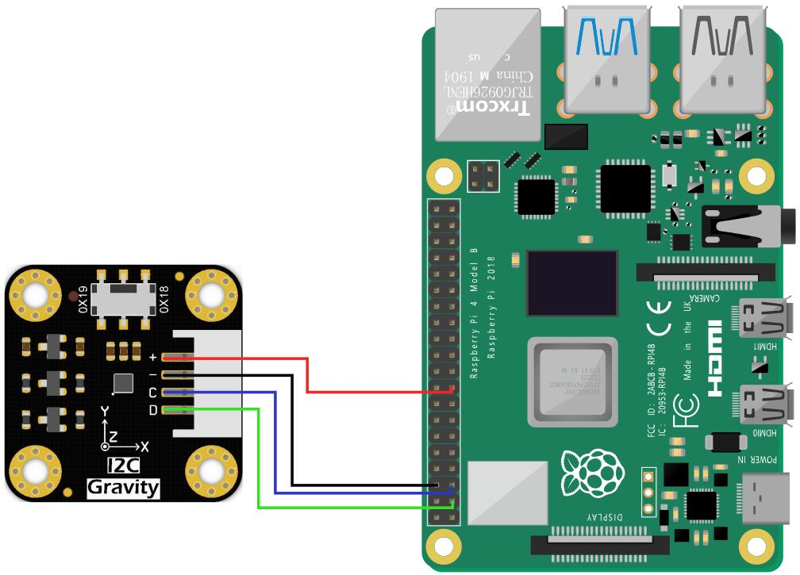

# Controlling Accelerometer using Raspberry PI

## Connections:
Connect the module to the Raspberry Pi according to the connection diagram. The default I2C address is 0x19.



### Physical Pins connection

- '+' => 17 (3.3V pin)
- '-' => 6 (GND)
- C   => 5
- D   => 3

### Drivers Installation
1. Enable the I2C interface of the Raspberry Pi. If it is already enabled, you can skip this step. Open Terminal, type the following command, and press Enter:
```
    sudo raspi-config
```
Then use the up and down keys to select "5 Interfacing Options", press Enter, select "P5 I2C", and press Enter to confirm "YES". Restart the Raspberry Pi main control board.

2. To install Python dependent libraries and git, the Raspberry Pi needs to be connected to the Internet. If it is already installed, you can skip this step. In the terminal, type the following commands in sequence, and press Enter:

```
sudo apt-get update
sudo apt-get install build-essential python-dev python-smbus git

```

## Running
To run the specific feature of accelerometer, go to that folder and run using the following command

```
python3 XXX.py
```

If you encounter import error, then try to keep the `DFRobot_LIS2DW12` python file in the required folder and try.

